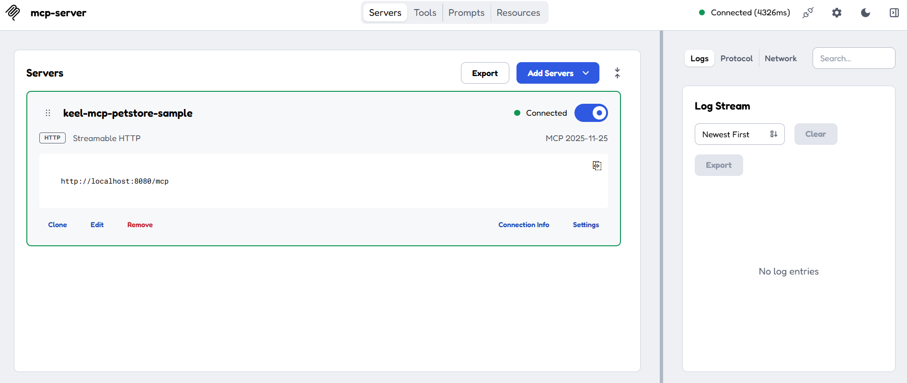
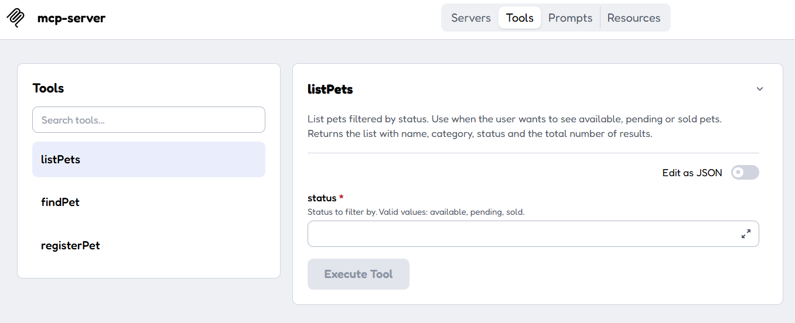
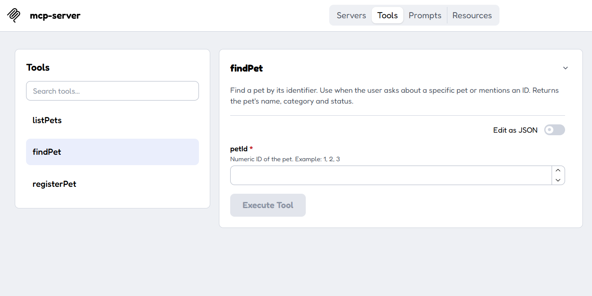
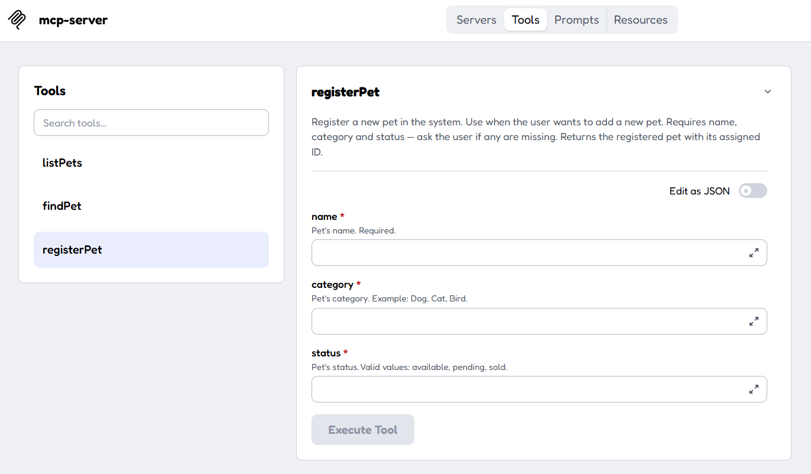

# Keel MCP Petstore Sample

A reference MCP Server built with the [Keel Framework](https://keelframework.io), demonstrating a complete, real-world integration: JWT authentication, a REST backend adapter, structured logging, and MCP Tools / Prompts / Resources — all working out of the box against **public, zero-setup services**, so you can clone, run, and explore without registering for anything.

## What this sample demonstrates

- ✅ **3 MCP Tools** calling a real external REST API (`findPet`, `listPets`, `registerPet`)
- ✅ **2 MCP Prompts** guiding the LLM through common flows (lookup by ID, guided data collection)
- ✅ **1 MCP Resource** documenting the available tools for the LLM
- ✅ **JWT authentication** (Streamable HTTP), validated against a public OIDC demo IdP
- ✅ **Structured JSON logging** (technical, functional, security) via Keel Observability
- ✅ Resilient JSON deserialization against a **publicly writable** backend with years of inconsistent data

No Keycloak, no API keys, no signup — everything runs against public demo services.

## Prerequisites

- Java 25
- Maven 3.8+
- An internet connection (both backends used are public, hosted services)

## Backends used (public, no setup required)

| Purpose | Service | URL |
|---|---|---|
| REST data | [Swagger Petstore](https://petstore3.swagger.io) demo API | `https://petstore3.swagger.io/api/v3` |
| JWT / OIDC | [Duende IdentityServer](https://demo.duendesoftware.com) public demo | `https://demo.duendesoftware.com` |

⚠️ Both are **public, shared** demo services. Don't rely on them for anything beyond trying out this sample — data may be reset, and other people's test data (with inconsistent shapes) is exactly why this project's DTOs are written defensively (see [Handling inconsistent public data](#handling-inconsistent-public-data) below).

## Running locally

```bash
git clone https://github.com/Keel-Framework/keel-mcp-petstore-sample.git
cd keel-mcp-petstore-sample/petstore-sample-boot
mvn clean install
mvn spring-boot:run
```

The server starts on `http://localhost:8080`, MCP endpoint at `POST /mcp`.

### Getting a JWT to authenticate requests

This sample validates JWTs against the public Duende demo IdP using the `client_credentials` grant (machine-to-machine, no user login needed):

```bash
curl -X POST "https://demo.duendesoftware.com/connect/token" \
  -H "Content-Type: application/x-www-form-urlencoded" \
  -d "client_id=m2m&client_secret=secret&grant_type=client_credentials&scope=api"
```

Copy the `access_token` from the response and use it as a `Bearer` token in the `Authorization` header of every request to `/mcp`.

### Connecting with MCP Inspector (recommended)

```bash
npx @modelcontextprotocol/inspector@latest
```

In the Inspector UI:
1. **Transport Type**: `Streamable HTTP`
2. **URL**: `http://localhost:8080/mcp`
3. **Authorization header**: `Bearer <your-token>`
4. Click **Connect**

You should see 3 tools, 2 prompts, and 1 resource listed.



Tools - listPets::



Tools - findPet::


Tools - registerPet::



## Tools

| Tool | Description | Backend call |
|---|---|---|
| `findPet(petId)` | Look up a pet by its numeric ID | `GET /pet/{petId}` |
| `listPets(status)` | List pets filtered by status (`available`, `pending`, `sold`) | `GET /pet/findByStatus?status=...` |
| `registerPet(name, category, status)` | Register a new pet | `POST /pet` |

## Prompts

| Prompt | Purpose |
|---|---|
| `petstore-find-pet` | Template for looking up a pet by ID |
| `petstore-register-pet` | Guides the model to collect `name`, `category` and `status` before calling `registerPet`, via a two-message (USER + ASSISTANT) example |

## Resources

| Resource | URI | Purpose |
|---|---|---|
| Tools guide | `petstore://tools-guide` | Plain-text guide describing when and how to use each tool |

## Handling inconsistent public data

`petstore3.swagger.io` is a **publicly writable** demo used by countless developers over the years. Some existing entries have data shapes that don't match the OpenAPI spec exactly (e.g. a `tags` entry that's a plain string instead of `{"id": ..., "name": ...}`). This sample's DTOs handle that gracefully:

```java
@JsonCreator(mode = JsonCreator.Mode.DELEGATING)
public static Tag fromString(String name) {
    return new Tag(null, name);
}
```

If you're building against your own backend with clean, controlled data, you likely won't need this kind of defensive deserialization — it's included here specifically because this sample targets a public, shared sandbox.

## Project structure

```
petstore-sample/
├── petstore-sample-model/     # DTOs (PetstoreDTO), error message constants
├── petstore-sample-mcp/       # Tools, Prompts, Resources
└── petstore-sample-boot/      # Spring Boot application, configuration
```

## Configuration

Local configuration lives in `petstore-sample-boot/src/main/resources/application-local.yml`:

```yaml
keel:
  adapters:
    rest-client:
      services:
        petstore:
          base-url: https://petstore3.swagger.io/api/v3
          log-requests: true
  mcp:
    transport:
      auth:
        enabled: true
        jwt:
          issuer: https://demo.duendesoftware.com
          jwks-uri: https://demo.duendesoftware.com/.well-known/openid-configuration/jwks
```

## Built with Keel Framework

This sample is powered by [Keel Framework](https://keelframework.io) — an architecture for building production-ready MCP Servers on Spring AI, with JWT auth, session management, observability, and REST adapters handled for you.

- 📖 [Keel Framework documentation](https://keelframework.io/docs/introduction.html)
- 🚀 [Quickstart guide](https://keelframework.io/docs/quickstart.html)
- 💻 [Keel Framework source](https://github.com/Keel-Framework/keel-mcp-java)

## License

Apache License 2.0 — see [LICENSE](LICENSE).
